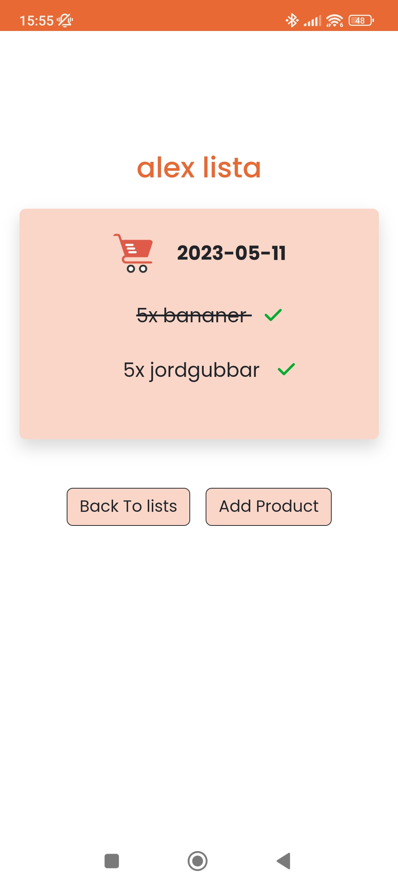
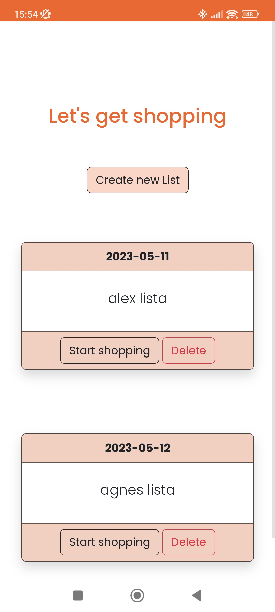
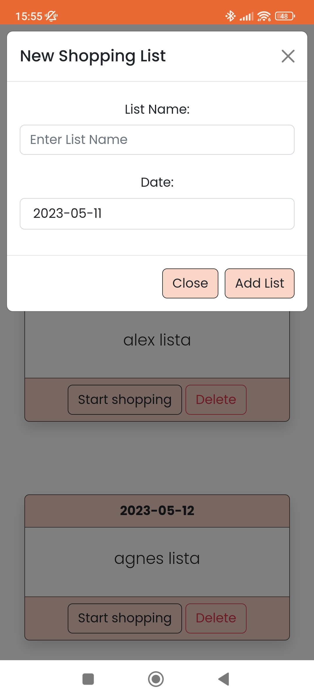
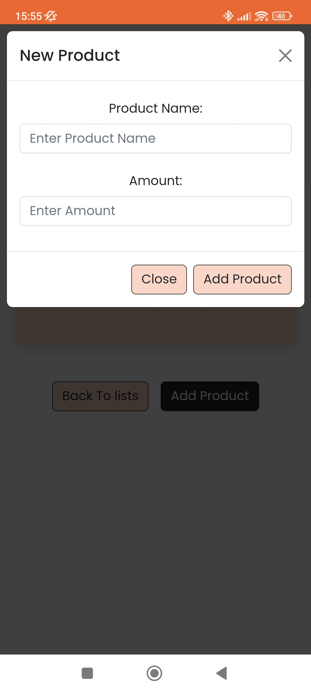
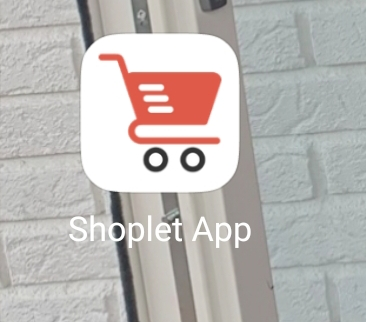

<h2>Shoplet - A fun little side project</h2>

Not yet done.. work in progress, a Spring boot backend api is connected to this frontend

<ul>
    <li>Prepare shopping lists at home and check off groceries while shopping</li>
    <li>Easy shopping list UI making it easy to add/remove groceries while shopping</li>
    <li>Works aswell as an Progressive Web App, save as shortcut on your phone and it will behave as a native mobile app</li>
</ul>

<h2>Images From App</h2>

    
    
    
    
    

